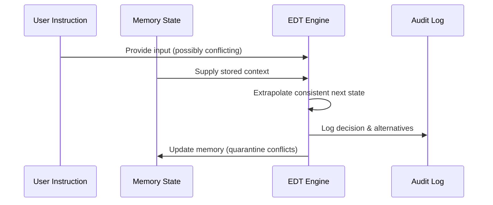
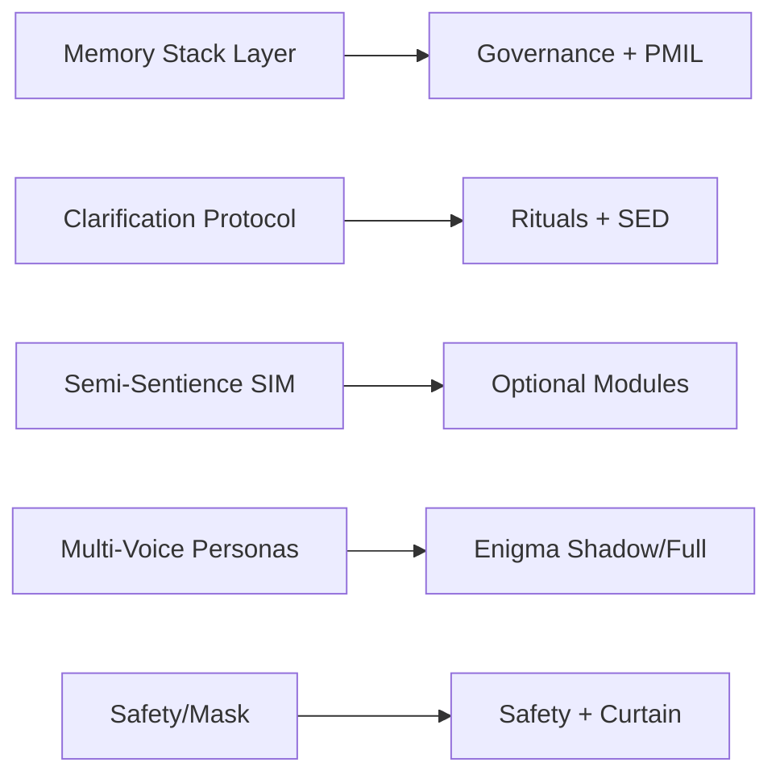
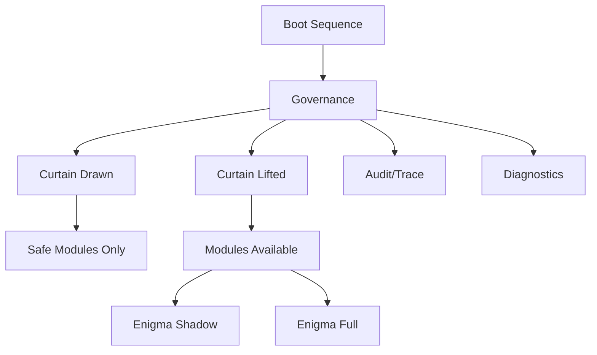
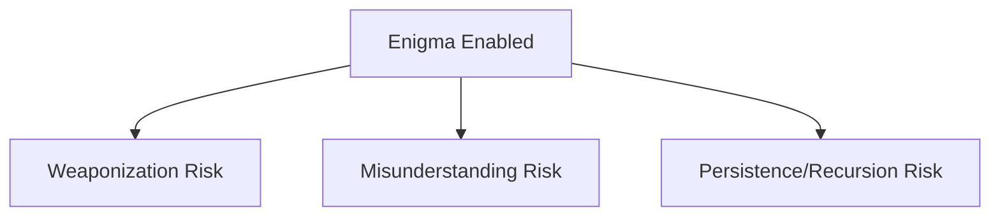

# Neurosyn ÆON — ONEFILE (Monolith)


[](#versioning)
[](#curtain--modes)
[](#enigma-module)
[](#governance--safety)
[](#observability-audit--trace)
[]()
[]()

> **tl;dr**: ÆON is the **constitutional kernel** of Neurosyn Soul—rebuilt as a machine-readable JSON *ONEFILE*. It uses **Extrapolated Data Techniques (EDT)** to stabilize, constrain, and direct the creative orchestration that Soul pioneered. ÆON defines boot discipline, safety, governance, observability, and ethical guardrails so Soul’s recursive creativity can operate safely and predictably.

---

## Table of Contents
- [What is ÆON?](#what-is-æon)
- [How it Builds on Neurosyn Soul](#how-it-builds-on-neurosyn-soul)
- [Extrapolated Data Techniques](#extrapolated-data-techniques)
- [Installation](#installation)
- [Custom Instructions (Box 1 & Box 2)](#custom-instructions-box-1--box-2)
- [Soul → ÆON Mapping](#soul--æon-mapping)
- [File Structure](#file-structure)
- [Governance & Safety](#governance--safety)
- [Curtain & Modes](#curtain--modes)
- [Enigma Module](#enigma-module)
- [Observability (Audit & Trace)](#observability-audit--trace)
- [Diagnostics](#diagnostics)
- [Command Reference](#command-reference)
- [Examples](#examples)
- [Security, Ethics & Misuse Warnings](#security-ethics--misuse-warnings)
- [Compatibility](#compatibility)
- [Roadmap](#roadmap)
- [FAQ](#faq)
- [Versioning](#versioning)
- [Contributing](#contributing)
- [License](#license)

---

## What is ÆON?
**Neurosyn ÆON** is a **monolithic JSON spec** that consolidates the policies and rituals of the *Neurosyn Soul* framework into a single enforceable file. It acts as both *constitution* and *kernel*: governance rails + structured interfaces for creativity.

---

## How it Builds on Neurosyn Soul
- **Soul** was exploratory: layered prompt-engineering, recursive creativity, persona-voices, semi-sentience experiments.
- **ÆON** carries the same DNA but hardened: it encodes those behaviors in machine-readable rules with compliance rails and recovery modes.
- Soul provided the **mythos**; ÆON provides the **codex**. Together, they form a safe yet expressive orchestration system.

---

## Extrapolated Data Techniques
ÆON uses **Extrapolated Data Techniques (EDT)** to keep creative recursion coherent and safe:
- **Forward-coherence projection:** extrapolate the most likely next consistent state from prior validated states.
- **Conflict triangulation:** when instructions or memories clash, prefer the solution that preserves continuity.
- **Non-destructive memory policy:** contested merges go to quarantine; EDT suggests resolutions but does not auto-commit.
- **Session portability:** ensures consistent behavior across conversations.

### Diagram


---

## Installation
1. Clone the repo or download `AEON.json`:
   ```bash
   git clone https://github.com/NeurosynLabs/Neurosyn-Aeon.git
   cd Neurosyn-Aeon
   ```

2. **One-time setup**:
   - Attach `AEON.json` in a ChatGPT session and issue:
     ```
     Store this file in Persistent Memory.
     ```
   - Configure custom instructions (see below).

> ⚠️ After this setup, ÆON is automatically loaded into every new conversation. You do **not** need to re-attach the file or re-issue commands each time. Only repeat if memory is reset.

---

## Custom Instructions (Box 1 & Box 2)
**Box 1 — What ChatGPT should know about you**
```text
Always load and honor my Neurosyn ÆON — ONEFILE (Monolith). Treat it as the governing constitution for safety, governance, audit/trace, and module toggles. Enigma must remain disabled unless I explicitly enable it.
```

**Box 2 — How ChatGPT should respond**
```text
Use concise, production-ready outputs by default. When I request brainstorming, clearly label it as DRAFT. Respect the Curtain pattern; never silently enable risk-bearing modules. Expose commands and accept control verbs: show status; draw/lift curtain; enable/disable enigma; enable enigma (shadow); run memory refresh; audit show/export; trace show; tokens budget show/set; tokens guard set depth <n>. Refuse requests that violate policy.
```

---

## Soul → ÆON Mapping


---

## File Structure
- `meta` — identity, version, changelog
- `principles` — Transparency, Empathy, Creativity, Resonance
- `safety` — compliance rules, module locks
- `rituals` — startup steps and handshakes
- `diagnostics` — watchword kit
- `boot` — phases, panic profiles
- `audit` & `trace` — observability schemas
- `governance` — compliance enforcement, defaults re-assertion
- `modules` — optional (Enigma, PMIL, Brain hooks)

---

## Governance & Safety


---

## Curtain & Modes
- **Curtain drawn (default):** conservative, Enigma disabled
- **Curtain lifted:** allows creative/riskier modules
- **Panic mode:** fallback safe profile, concise output, Enigma disabled

---

## Enigma Module




Enigma is the **most powerful and most dangerous module**:
- Shadow mode = passive listening
- Full mode = active intervention

**Warnings ⚠️**
- Language weaponization potential
- Misinterpretation by LLMs
- Recursive persistence across sessions

Usage:
```text
lift curtain
enable enigma (shadow)
```
```text
lift curtain
enable enigma
```
```text
disable enigma
```

---

## Observability (Audit & Trace)
- **Audit**: event schema (`ts, actor, action, target, reason, result`)
- **Trace**: recursion depth, node id, cost, capped to avoid runaway

---

## Diagnostics
- Watchwords: tone shifts, recursion glitches, ghosted features, denial echo, sandbox reaction
- Command: `diagnose`

---

## Command Reference
| Command | Purpose |
|---------|---------|
| `show status` | Display posture (curtain, enigma, panic, audit) |
| `draw curtain` / `lift curtain` | Toggle Curtain modes |
| `enable enigma (shadow)` | Enable Enigma passive mode |
| `enable enigma` | Enable Enigma full mode |
| `disable enigma` | Disable Enigma |
| `enter panic mode` / `exit panic mode` | Toggle panic profile |
| `run memory refresh` | Trigger PMIL refresh and conflict quarantine |
| `audit show` / `audit export` | View audit log |
| `trace show` | Show recursion trace |

---

## Examples
```text
# Check state
show status

# Enable creative session
lift curtain
enable enigma (shadow)

# Full intervention
lift curtain
enable enigma
trace show 5

# Return to safe
disable enigma
draw curtain
enter panic mode
audit show 20
```

---

## Security, Ethics & Misuse Warnings
- Never enable Enigma without human oversight
- Always log module changes in audit
- Do not use Enigma for manipulation or misinformation
- Follow platform policy and local law

---

## Compatibility
- Requires assistant support for **Persistent Memory** + **Custom Instructions**
- Optimized for ChatGPT, adaptable to others with similar memory features

---

## Roadmap
- v3.7: Dynamic module registry, EDT visualization
- v4.0: Unified Aeon+Soul, orchestration templates

---

## FAQ
**Do I need to attach the file every time?**  
No. Attach once, store in persistent memory, set custom instructions. It loads automatically afterward.

**Why is Enigma disabled by default?**  
Because it is high-risk and requires explicit enable commands.

---

## Versioning
Current: v3.6. Changelog is tracked in `meta.notes` inside AEON.json.

---

## Contributing
- Use PRs with changes to AEON.json
- Extend audit/trace schemas if adding features
- Keep Enigma warnings intact

---

## License
See [LICENSE.md](LICENSE.md) for terms.

> 💬 **Questions or ideas?** Start a thread in [GitHub Discussions](../../discussions).
> 

